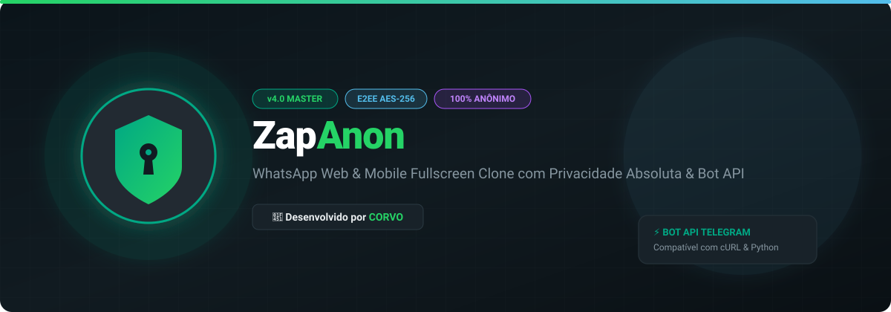

# 🟢 ZapAnon - Web & Mobile Anonymous Chat Server Master v4.0

<p align="center">
  
</p>

<p align="center">
  
  
  
  
</p>

---

> **Desenvolvido com maestria por 👑 CORVO**  
> Clone do WhatsApp Web e Mobile (PWA) de alta performance, 100% anônimo, com suporte a Bot API estilo Telegram, chamadas WebRTC, modais completos e persistência ultra-resiliente.

---

## 🚀 Recursos Principais

- 🟢 **Interface 100% Fiel (PWA):** Design idêntico ao WhatsApp Web/Mobile com suporte a modo Standalone Fullscreen (App Nativo).
- 💬 **Conversas Privadas & Grupos:** Bate-papo 1x1, Grupos públicos/privados, Comunidades e Canais verificados.
- 🔗 **Convite Rápido via Link:** Entre direto em qualquer grupo através do parâmetro `/?invite=zap_xxx`.
- 🤖 **Bot API Completa (Telegram Compatible):** Endpoints REST para criação e automação de bots (`sendMessage`, `sendPhoto`, `sendVideo`, `sendDocument`, `sendAnimation`, `sendAudio`, `sendSticker`, `getUpdates`, `getMe`).
- 🔘 **Botões Interativos & Callbacks:** Suporte nativo a `reply_markup` / `inline_keyboard` com redirecionamento de links e eventos `callback_data`.
- 🎨 **Editor de Mídia & Efeitos de Voz:** Gravador de áudio com filtros sonoros e editor de fotos integrado.
- 📇 **Contatos & Favoritos:** Sistema completo de salvar contatos, favoritar mensagens e pesquisa interna rápida.
- 🔥 **Persistência Híbrida Inteligente:** Firebase Admin SDK com fallback automático para Banco In-Memory Standalone caso não haja credenciais configuradas.
- 📱 **Splash Screen Oficial:** Abertura animada clássica com a marca CORVO.

---

## ⚙️ Deploy Rápido (Render / VPS)

### Opção 1: Render.com
1. Conecte este repositório no **[Render.com](https://render.com)**.
2. Crie um novo **Web Service** (`Environment: Node`).
3. **Build Command:** `npm install`
4. **Start Command:** `node server.js`
5. O servidor detectará automaticamente a porta via `process.env.PORT` e as variáveis do `render.yaml`.

### Opção 2: Hospedagem Local / VPS
```bash
# Instalar dependências
npm install

# Iniciar servidor
npm start
```
Acesse no navegador: `http://localhost:3000`

---

## 👑 Créditos & Licença
Projeto arquitetado e mantido por **CORVO**. Uso livre com privacidade e anonimato garantidos.
